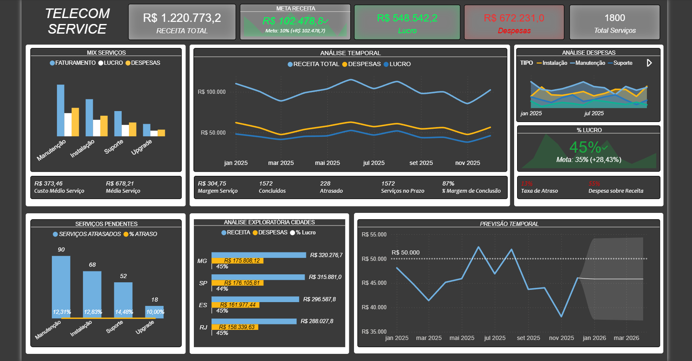

📊 Projeto – Análise Operacional | Telecom

Este projeto simula um cenário real de operações no setor de telecom, com 1800 ordens de serviço distribuídas entre diferentes estados, técnicos e níveis de prioridade.

O objetivo foi desenvolver um pipeline completo de análise de dados, desde a geração da base até a construção de um dashboard executivo.

🛠 Tecnologias Utilizadas
	
•	Python (pandas, numpy)

•	Excel (Power Query + análise exploratória)
	
•	Power BI (dashboard executivo)
	
•	GitHub (versionamento e documentação)

⸻

📂 Estrutura do Projeto
	
•	notebook/ → 
	
•   View Dataset → [Dataset View/ ↗](https://github.com/JottaMarcos/conectarfiber/blob/main/View_Dataset_Excel.png)
                   [Dataset View/ ↗](https://github.com/JottaMarcos/conectarfiber/blob/main/View_Analise_Exploratoria.png)
	
