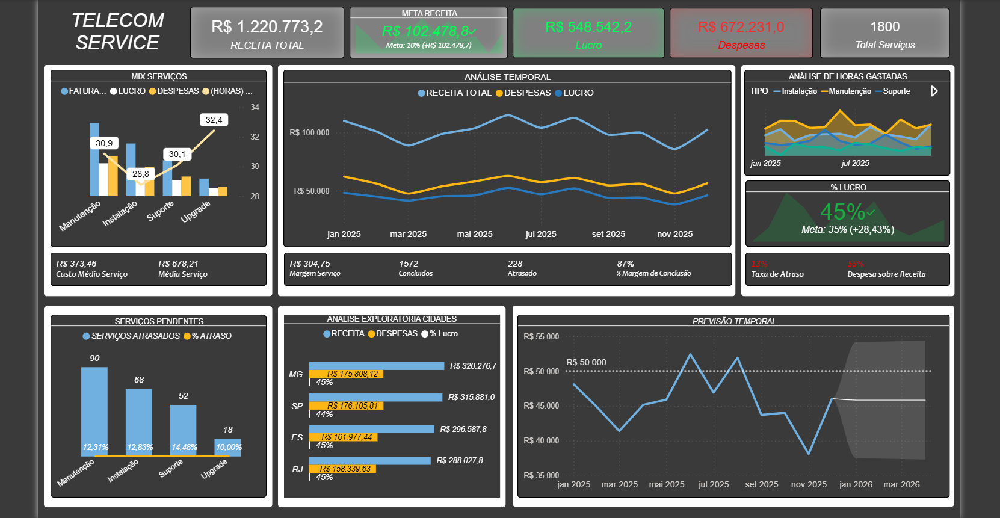

📊 Projeto – Análise Operacional | Telecom

🚀 Otimização de Margem e Eficiência Operacional em Telecom: De Dados Brutos a Insights Executivos.

🧠 Insights Extraídos da Análise:

• Gargalo de Lucratividade: Identifiquei que o serviço de Suporte, apesar de ter um volume alto, apresenta a menor margem de lucro devido ao alto custo de horas gastas por chamado.

• Performance Regional: A região de MG apresenta a melhor eficiência operacional (maior lucro relativo), enquanto o RJ possui a maior receita bruta, sugerindo oportunidades distintas de expansão vs. otimização.

• Previsão de Receita: Utilizando modelos de séries temporais, projetei uma estabilização do faturamento em R$ 50k/mês, permitindo um planejamento financeiro mais seguro para os próximos trimestres.

🛠 Tecnologias Utilizadas
	
• Extração & Limpeza (Python): Tratamento de dados nulos, conversão de tipos de data e criação de métricas calculadas (como Lucro e Margem) usando Pandas.

• Modelagem (Power BI): Criação de medidas complexas em DAX para KPIs dinâmicos (Taxa de Atraso, Meta de Receita, % de Lucro).

• Storytelling (Dashboard): Design focado na tomada de decisão rápida, utilizando gráficos de tendência e filtros por estado e serviço.

⸻

📂 Estrutura do Projeto
	
•	notebook/ → 
	
•   View Dataset → [Dataset View/ ↗](https://github.com/JottaMarcos/conectarfiber/blob/main/View_Dataset_Excel.png)
                   [Dataset View/ ↗](https://github.com/JottaMarcos/conectarfiber/blob/main/View_Analise_Exploratoria.png)

•	Projeto Power BI → [Dataset View/ ↗](https://github.com/JottaMarcos/conectarfiber/blob/main/Telecom_Analytics.pbix)
	
