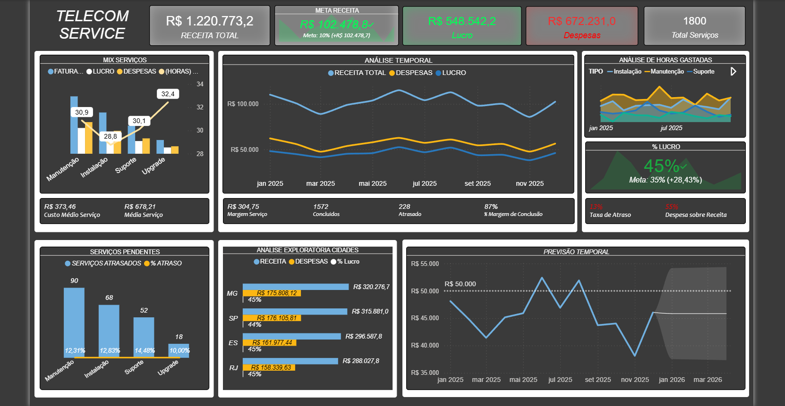

<div align="center">

# 📡 ConectarFiber — Análise Operacional Telecom

**Otimização de margem e eficiência operacional: de dados brutos a insights executivos**


</div>

---

## 🎯 O Problema de Negócio

Empresas de telecomunicações operam com alto volume de serviços e custos variáveis difíceis de monitorar. Este projeto analisa a operação de uma provedora de fibra ótica para identificar **gargalos de lucratividade, diferenças regionais de performance e projeções de receita** — transformando dados operacionais em decisões estratégicas.

---

## 📊 Dashboard Executivo



---

## 🛠️ Stack Utilizada

| Camada | Tecnologia |
|--------|-----------|
| Extração e limpeza | Python · Pandas · Jupyter |
| Tratamento de dados | Excel |
| Modelagem e KPIs | Power BI · DAX |
| Dataset | Gerado sinteticamente em Python |

---

## 📂 Estrutura do Projeto

```
conectarfiber/
│
├── Import_Dataset.ipynb         → Geração e tratamento do dataset em Python
├── Dataset_Telecom.xlsx         → Dataset tratado no Excel
├── Telecom_Analytics.pbix       → Dashboard Power BI com DAX
│
├── Dashboard_telecom.png        → Print do dashboard final
├── View_Dataset_Excel.png       → Visualização do dataset no Excel
└── View_Analise_Exploratoria.png → Visualização da análise exploratória
```

---

## ⚙️ Etapas do Projeto

### 1️⃣ Extração e Limpeza — Python

Tratamento de dados nulos, conversão de tipos de data e criação de métricas calculadas como Lucro e Margem usando Pandas.

[📓 Ver notebook Python](./Import_Dataset.ipynb)

---

### 2️⃣ Tratamento — Excel

Organização e validação dos dados antes da importação para o Power BI.

[📊 Ver dataset no Excel](./View_Dataset_Excel.png) · [📈 Ver análise exploratória](./View_Analise_Exploratoria.png)

---

### 3️⃣ Modelagem e Visualização — Power BI

Criação de medidas complexas em DAX para KPIs dinâmicos: Taxa de Atraso, Meta de Receita e % de Lucro. Dashboard com foco em tomada de decisão rápida, com filtros por estado e tipo de serviço.

[📁 Ver arquivo Power BI](./Telecom_Analytics.pbix)

---

## 💡 Principais Insights

### 🔴 Gargalo de Lucratividade
O serviço de **Suporte**, apesar do alto volume, apresenta a **menor margem de lucro** — o custo elevado de horas por chamado corrói o resultado operacional.

### 🗺️ Performance Regional
| Região | Destaque |
|--------|----------|
| **Minas Gerais** | Melhor eficiência operacional — maior lucro relativo |
| **Rio de Janeiro** | Maior receita bruta — oportunidade de expansão |

> MG e RJ exigem estratégias distintas: otimização vs. crescimento.

### 📈 Previsão de Receita
Utilizando modelos de séries temporais, foi projetada uma **estabilização do faturamento em R$ 50 mil/mês**, permitindo planejamento financeiro mais seguro para os próximos trimestres.

---

## 🔑 Resultados Entregues

- ✅ Identificação do serviço com menor margem de lucro
- ✅ Mapeamento de performance por região com estratégias distintas
- ✅ Projeção de receita com séries temporais
- ✅ Dashboard executivo com KPIs dinâmicos em DAX
- ✅ Pipeline completo: Python → Excel → Power BI

---

## 👤 Autor

**João Marcos** — Data Analyst | Power BI · Python · SQL

[](https://www.linkedin.com/in/joão-marcos-347311230)
[](https://github.com/JottaMarcos)
